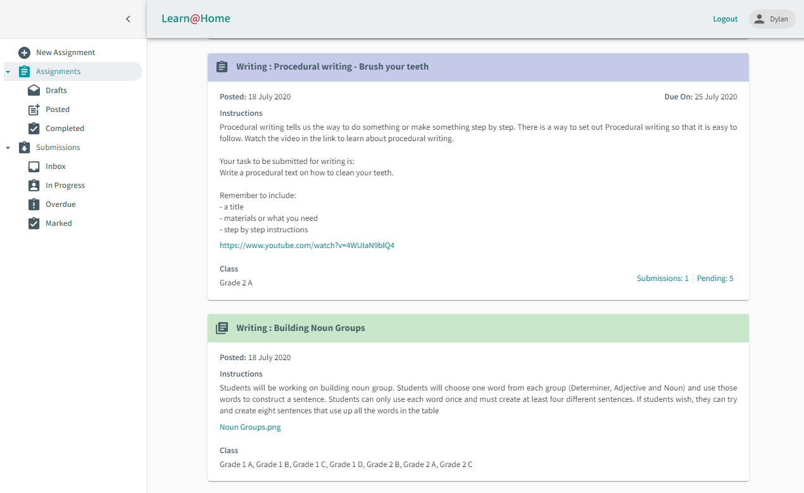
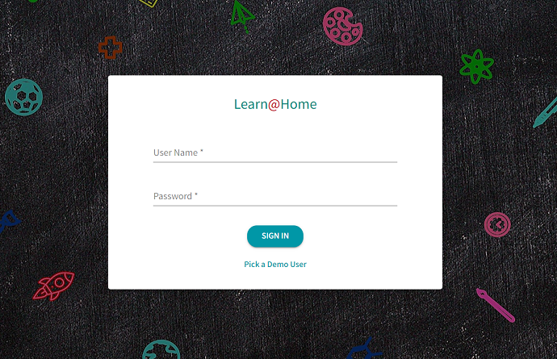
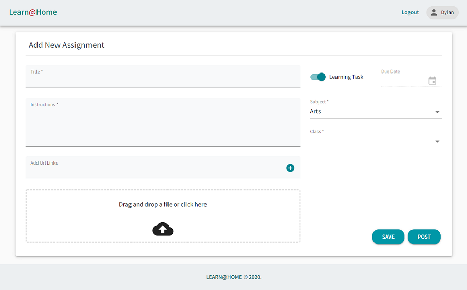
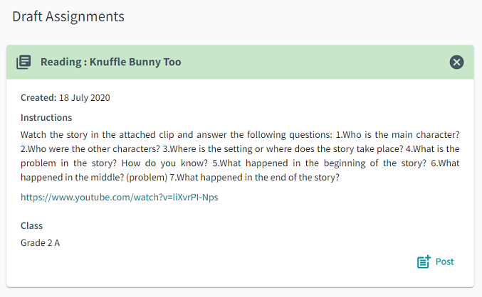
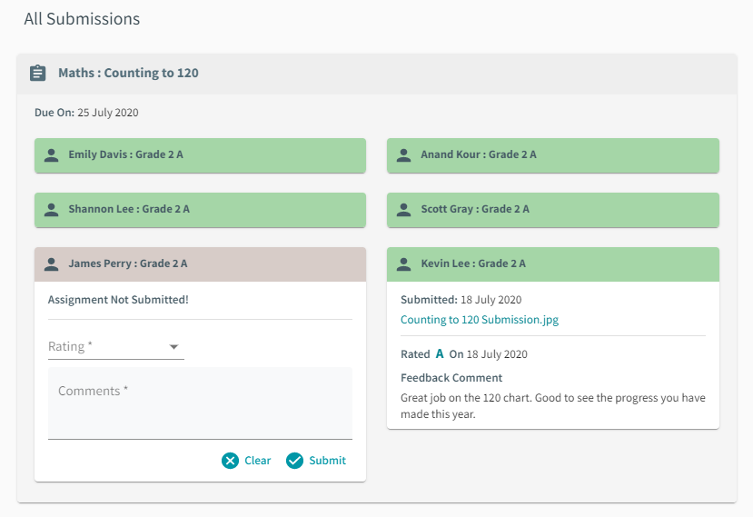
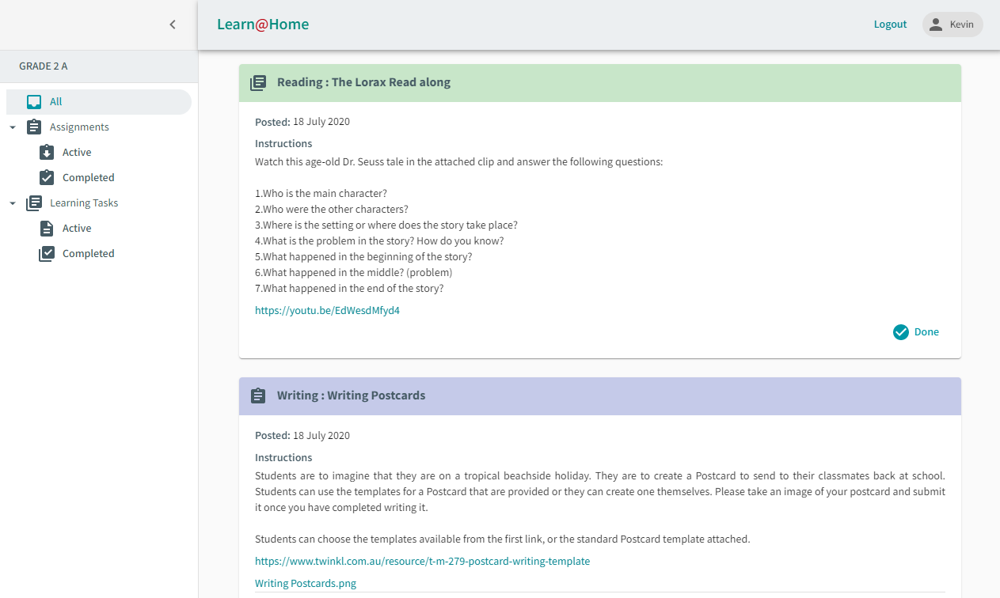
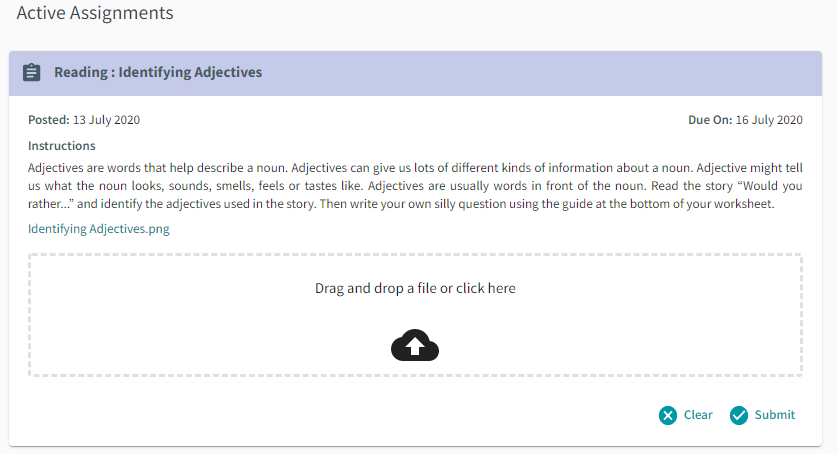
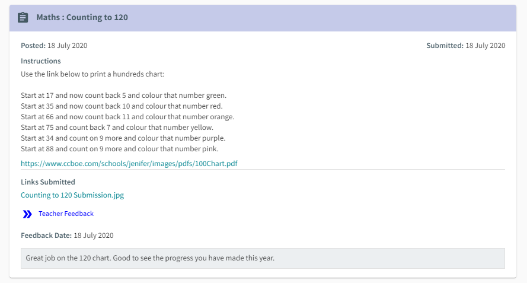

# Learn @ Home

## Description 

Learn@Home is a home schooling solution that aims to simplify the process of creating, distributing, and grading primary school assignments. It helps teachers and students stay up to date with their lessons and homework.  
 

  

## Application Access 
The Application can be accessed using the below link:  
[https://learn-at-home.herokuapp.com/](https://learn-at-home.herokuapp.com/)

This application is only available to registered users.  
To keep things simple, all passwords are set up to match the user ids. For e.g. to log in as user `dprice`, use the password: `dprice`

Feel free to use the below user ids to access the system:

* Teacher: `dprice` 
* Student: `klee` 

Alternate Teachers / Students set up in the system:  

* Teacher: `lhall` 
* Students:  
  * Grade 2A : `edavis`, `akour`, `slee`, `sgray`, `jperry`, `klee`
  * PREP B : `tlee`, `hjones`, `amiller`, `mpatil`, `dtran`, `gvee`

## Table of Contents 

- [Technical Features](#technical-features)
 - [MERN Stack](#mern-stack)
 - [Dropbox](#dropbox)
 - [User Authentication and Security](#user-authentication-and-security)
 - [Responsive Web Design](#responsive-web-design)
- [Usage Guidelines](#usage-guidelines)
 - [Login](#login)
 - [New Assignment - Teacher](#new-assignment---teacher)
 - [View Assignments - Teacher](#view-assignments---teacher)
 - [View Submissions - Teacher](#view-submissions---teacher)
 - [Student Dashboard](#student-dashboard)
  

## Technical Features

### MERN Stack
This application is developed using the MERN stack- It uses React and Material UI for the front end; The backend is powered by Node.js with express server, MySQL as the database, and sequelize as the ORM. 

### Dropbox
All files in the application are uploaded to dropbox, and downloaded on request thereafter. I have used the dropbox API for this. 
We need to use third party file storage because this applicaion is deployed on Heroku, which uses an ephemeral filesystem (i.e. uploaded files get deleted when the application is shut down or restarted). There are other paid integration options available, but for the current demonstration dropbox is a simple solution. 

### User Authentication and Security
Learn@Home uses express-session and passport middlewares for maintaining user sessions and authenticating user requests. Additionally, all passwords in the system are hashed using bcryptjs before being persisted. This security feature prevents any person with access to the database from being able to view or use the passwords of users in the system. 

### Responsive Web Design 
This application is built using Responsive web design principles. To achieve this, I have used the Material UI component library with styling to ensure pages render on all screen sizes.

## Usage Guidelines

### Login 

When the Learn@Home application is opened, it displays the below login page:  

  

* To log in to the system, use the user id and password provided and click sign in. 
* If the login details are correct, the user is logged in to the system, and they can view the teacher / student dashboard based on their access level.
* If the login details are incorrect, an error message is displayed on the top of the form.

 

### New Assignment - Teacher
Once a user is logged in with teacher access, they see the create new assignment page:

  

* Here they can enter the assignment details, add urls to be included and upload files to be attached with the task. 
* By default assignments are "Learning Tasks" - i.e. they do not require a submission from the student. To create assignments with submission, turn off learning task mode and specify a due date for the assignment.
* The teacher can then select a subject for the assignment from the list of subjects they teach.
* Based on the Subject selected, the list of classes they apply to will be updated accordingly.
* The teacher can select one or more classes they need to assign the task to.
* Clicking Save creates a draft assignment that is not visible to the students.
* Clicking Post will save the assignment and post it for the students to work on.
* In case the form data is incomplete, a validation message is displayed.
* Once the assignment is posted or saved, a success toast message is displayed on the bottom left of the screen.

### View Assignments - Teacher
Clicking on 'Assignments' from the left navigation menu brings up the View Assignments page:

  

* Here a teacher can view all the assignments saved or posted by them. The below assignment page options are available in the left navigation menu:
 * Assignments - shows all assignments in the system
   * Drafts - shows assignments that have not been posted yet
   * Posted - shows assignments that have been posted, but are not completed
   * Completed - shows assignments that have been posted and completed

    For an assignment to be `completed` - all students targetted by the assignment need to have their submissions rated or marked. 

* All assignments requiring submission in the system have a blue header, all learning tasks have a green header 
* To collapse/expand an assignment / learning task, click the icon in the header.
* Click on the assignment url or file attachment link to view it in a new window.
* Assignments that are posted and requiring submission will display the number of student submissions and the number of pending submissions. Click on this link to view the student submissions page.
* All draft assignments will have an option to post / delete the assignment as below:

* To post an assignment, click the post button. This will display a toast on success.
* To delete an assignment, click the delete button in the header. This will display a toast on success.

### View Submissions - Teacher
Clicking on 'Submissions' from the left navigation menu brings up the View Submissions page:

  

* Here a teacher can view all the submissions made by students. The below submission page options are available in the left navigation menu:
 * Submissions - shows all submissions in the system
   * Inbox - shows new submissions that have not been marked yet
   * In Progress - shows students with pending submissions.
   * Overdue - shows students with pending submissions, and the assignment due date has elapsed.
   * Marked - shows submissions that have already been marked
* To collapse/expand a student's details - click the icon in the header.
* To collapse/expand an assignment - click the icon in the header.
* Click on the submission url or file attachment link to view it in a new window.
* All student submissions in the system have a green header, and all unsubmitted students have a purple header.
* To mark a submission, select a rating - optionally enter a comment and click submit. This will mark the submittion and display a success toast.
* If a student does not submit an assignment, the teacher has the option to mark it anyway, in order to complete the assignment. 
* Once an assignment is maked, the teacher can then view the rating and comments saved with the submission.

### Student Dashboard
Once a user is logged in with student access, they see the student dashboard page:

  

* Here a student can view all the tasks they need to do. The below page options are available in the left navigation menu:
 * All - shows all tasks assigned to the student
   * Assignments - shows all assignments requiring submission from the student
     * Active - shows assignments that need to be worked on.
     * Completed - shows assignments already submitted
   * Learning Tasks - shows all learning tasks assigned to the student 
     * Active - shows learning tasks that need to be worked on.
     * Completed - shows learning tasks already completed
* To collapse/expand an assignment - click the icon in the header.
* Click on the assignment url or file attachment link to view it in a new window.
* All assignments requiring submission in the system have a blue header, all learning tasks have a green header 
* To mark a learning task as completed - click the done button.
* To submit an assignment, upload a file and click submit:

  

* To view a teacher's comment on a submission, click the `Teacher Feedback` button:

  

* Click on the submission link url to view submitted files in a new window.